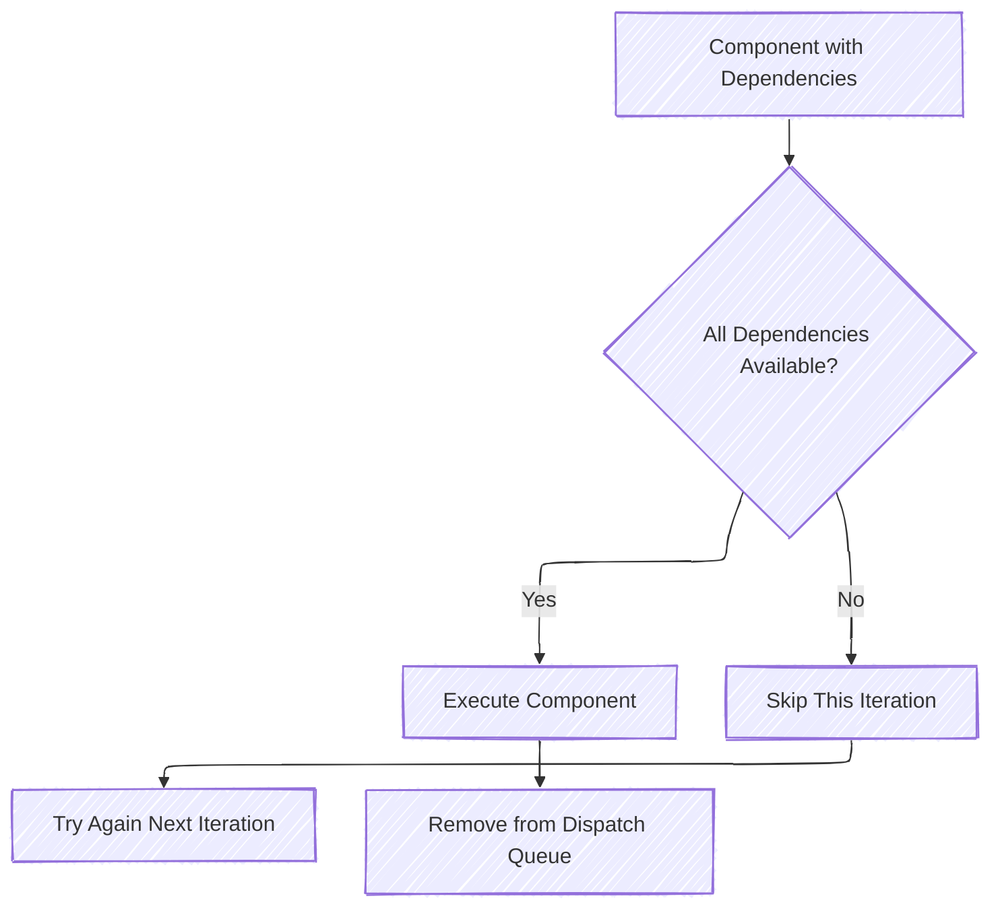
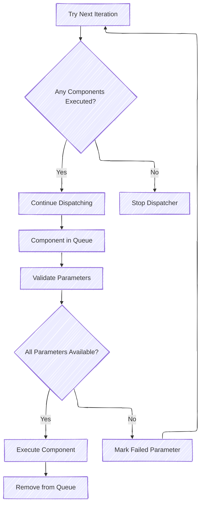

# Monolithically Compiled Components

There is no standard entry point for a monolithically compiled component that is dispatched by the Patina DXE Core.

Where the EDK II DXE Core dispatcher expects a well-defined entry point of
`EFI_HANDLE ImageHandle, EFI_SYSTEM_TABLE *SystemTable`, the Patina DXE Core uses
[Dependency Injection](https://wikipedia.org/wiki/Dependency_injection) to allow a component to define an interface
that specifies all dependencies needed to properly execute. Due to this, dependency expressions are no longer
necessary, as the function interface serves as the dependency expression. What this means is that instead of evaluating
a dependency expression to determine if a driver can be executed, the system attempts to fetch all requested parameters
defined in the function interface. If all are successfully fetched, then the component is executed. If not, it will not
be dispatched, and another attempt will be made in the next iteration.



## Defining Components

Components are defined by applying the `#[component]` attribute to an impl block that contains an `entry_point` method.
The `entry_point` method name is mandatory - all components must use this exact name.

The `#[component]` attribute automatically:

- Validates that an `entry_point` method exists with the required signature
- Validates parameters for conflicts at compile time
- Generates the necessary trait implementations to integrate with the dispatcher

The `#[component]` attribute validates that component parameters don't have conflicting combinations (like duplicate
`ConfigMut<T>` parameters or mixing `Config<T>` and `ConfigMut<T>` for the same type). The macro also automatically
generates the necessary trait implementations for component execution.

See [Samples](https://github.com/OpenDevicePartnership/patina/tree/main/components/patina_samples) or
[Examples](#examples) for examples of basic components.

Developing a component is as simple as writing an `entry_point` method whose parameters are part of the below list of
supported parameters (which is subject to change). Always reference the [Type Implementations][patina] for a complete
list, however the below information should be up to date.

## Component Execution



Components are executed by validating each individual parameter (See [Params](#component-params) below) in the
component. If all parameters are validated, then the component is executed and removed from the list of components to
execute. If any parameter fails to validate, then that parameter is registered as the failed param and the dispatcher
will attempt to validate and execute the component in the next iteration. The dispatcher stops executing when no
components have been dispatched in a single iteration.

## Component Params

Writing a component is as simple as writing a function whose parameters are a part of the below list of supported
types (which is subject to change). The `Param` trait is the interface that the dispatcher uses to (1) validate that a
parameter is available, (2) retrieve the datum from storage, and (3) pass it to the component when executing it. Always
reference the `Param` trait's [Type Implementations][patina] for a complete list of parameters that can be used
in the function interface of a component.

<!-- markdownlint-disable -->
| Param                        | Available When                   | Description                                                                                                       |
|------------------------------|----------------------------------|-------------------------------------------------------------------------------------------------------------------|
| Config\<T\>                  | After config is locked           | An immutable config value that will only be available once the underlying data has been locked.                   |
| ConfigMut\<T\>               | While config is unlocked         | A mutable config value that will only be available while the underlying data is unlocked.                         |
| Hob\<T\>                     | If GUID HOB exists in HOB list   | A parsed, immutable, GUID HOB (Hand-Off Block) that is automatically parsed and registered.                       |
| Service\<T\>                 | After service is registered      | A wrapper for producing and consuming services of a particular interface, `T`, that is agnostic to the underlying implementation. |
| Commands                     | Always                           | A deferred command queue for registering services and configs without conflicting with other params. See [Commands](#commands) section. |
| Handle                       | After image handle is set        | The DXE Core's image handle. See [Handle](#handle) section.                                                       |
| StandardBootServices         | After boot services init         | UEFI Boot Services access. See [StandardBootServices](#standardbootservices) section.                             |
| StandardRuntimeServices      | After runtime services init      | UEFI Runtime Services access. See [StandardRuntimeServices](#standardruntimeservices) section.                    |
| &Storage / &mut Storage      | Always                           | Direct storage access. Conflicts with `Config`/`ConfigMut` params. See [Storage Access](#storage-access) section. |
| (P1, P2, ...)                | When all inner params available  | A Tuple where each entry implements `Param`. Useful when you need more parameters than the current parameter limit. |
| Option\<P\>                  | Immediately                      | An Option, where P implements `Param`. Affects each param type differently. See [Option](#optionp) section.       |
<!-- markdownlint-enable -->

``` admonish warning
Certain combinations of parameters are invalid and will cause compile-time errors. The `#[component]` attribute
enforces parameter validation for pre-defined parameter types, detecting conflicts such as:

- Duplicate `ConfigMut<T>` parameters with the same type T
- Both `Config<T>` and `ConfigMut<T>` for the same type T
- `&mut Storage` combined with `Config<T>` or `ConfigMut<T>`
- `&Storage` combined with `ConfigMut<T>`
- Multiple `Commands`, `StandardBootServices`, or `StandardRuntimeServices` parameters
```

### Config\<T\> / ConfigMut\<T\>

`Config<T>` and `ConfigMut<T>` parameters are available for a platform or a component to produce a generic configuration
value that can be consumed by any other component. A platform can produce its own values by using the `Core`'s
`.with_config` method.

As mentioned above, a component can also produce a configuration value, but the flow is slightly more complex. A
component is able to set or modify a configuration value using the `ConfigMut<T>` parameter. These components are able
to then lock the configuration value via the `lock()` method. As you would guess, locking a configuration value makes
the value immutable. What this means is that from the moment `lock()` is called, no other component with a `ConfigMut<T>`
parameter (of the same `T`) will be executed.

From this point on, it also allows for any component with a `Config<T>` to be executed. What this means is that no
component with `Config<T>` parameters will be executed until the configuration is locked.

```admonish note
Executing components currently happens in two phases. We execute all components until there are no components executed
in that iteration. At that point, we lock all Configs and restart component execution.
```

By default, all `Config<T>` values are locked. However if a component is registered with the Core that requests
`ConfigMut<T>`, the value will be unlocked at that time. This is to allow components to execute immediately if it is
known that the configuration value will never be updated.

This type comes with a `mock(...)` method to make unit testing simple.

### Hob\<T\>

The `Hob<T>` parameter type is used to access a GUID HOB value, which is automatically parsed from the HOB list
provided to the Core during initialization. Unlike `Config<T>` and `ConfigMut<T>`, these types are **not** always
available. This means a component that has this parameter implemented will only be executed if the guided HOB is
found in the HOB list. Due to how HOBs work, the same GUID HOB can be provided multiple times by the platform.
Due to this, `Hob<T>` implements both `Deref` to access the first found value, or `IntoIterator` to iterate through
all HOB values.

This type comes with a `mock(...)` method to make unit testing simple.

### Service\<T\>

A `Service` exists as a way to share functionality across components. Some components may consume a service while
others may produce said service. This abstracts how consumers of said `Service` receive it. The platform can easily
swap implementation producers with no consumer being affected. A service can come in two flavors, a concrete struct
(`Service<MyStruct>`) or a zero-sized trait object (`Service<dyn MyInterface>`). The preferred implementation is the
latter as it simplifies mocking functionality for host-based unit tests, however it does come with some drawbacks. The
two main drawbacks are (1) functionality is accessed via a v-table, causing some performance degradation, and (2) dyn
trait objects do not support generics in their function interfaces.

Service implementations can be registered in two distinct ways. If the service implementation can be directly
instantiated with no other dependencies, then it can be registered directly during core instantiation with [Core::with_service](https://github.com/OpenDevicePartnership/patina),
which makes the service immediately available. If the service implementation does have dependencies, then a component
will be used to request those dependencies, instantiate the service, and pass it to the storage with [Storage::add_service](https://github.com/OpenDevicePartnership/patina).

If function generics are needed / wanted, it is suggested that most functionality be provided via a typical, mockable
trait object service, with a lightweight concrete struct Service Wrapper to support generics. This allows for easy
mocking of the underlying functionality, but provides an easy to use interface as seen below:

```rust
# extern crate patina;
use patina::{
    error::Result,
    component::service::Service,
};

trait TraitService {
    fn write_bytes(&self, bytes: Vec<u8>) -> Result<()>;
}

struct ConcreteService {
    inner: Service<dyn TraitService>
}

impl ConcreteService {
    fn write(&self, object: impl Into<Vec<u8>>) -> Result<()> {
        self.inner.write_bytes(object.into())
    }
}
```

```admonish important
Each service references the same underlying static and immutable type. This means that only the &self methods are
available and forces the implementor to manage their own interior mutability via some sort of locking mechanism. Each
component receives their own service instance (all of which point back to the same underlying implementation), which
allows them stash it for their own needs post component execution.
```

This type comes with a `mock(...)` method to make unit testing simple.

### Commands

`Commands` is a deferred command queue that allows a component to register services and configuration values without
conflicting with other parameters like `Config<T>` or `ConfigMut<T>`. Instead of modifying `Storage` directly during
component execution, the changes are queued and applied after the component finishes.

```rust
# extern crate patina;
use patina::{
    component::{component, params::Commands},
    error::Result,
};

# struct MyServiceImpl;
# use patina::component::service::IntoService;
# #[derive(Debug, IntoService)]
# #[service(dyn core::fmt::Debug)]
# struct DebugService;

pub struct MyComponent;

#[component]
impl MyComponent {
    fn entry_point(self, mut cmds: Commands) -> Result<()> {
        cmds.add_config(42i32);
        cmds.add_service(DebugService);
        Ok(())
    }
}
```

A `mock()` method is available to simplify writing unit tests.

### Handle

`Handle` provides the DXE Core's image handle for use cases when it is needed.

```admonish warning
This handle is the DXE Core's image handle, shared across all components. It should not be used as a
`DriverBindingHandle` in `EFI_DRIVER_BINDING_PROTOCOL`, as multiple components sharing the same agent handle will
conflict with protocol open/close tracking in the UEFI driver model.
```

`Handle` implements `Deref` to the underlying `r_efi::efi::Handle`, so it can be dereferenced directly.

This type comes with a `mock(...)` method to make unit testing simple.

### StandardBootServices

`StandardBootServices` provides immutable access to UEFI Boot Services functions. It is available once boot services
have been initialized. Each component receives its own cloned instance.

```rust
# extern crate patina;
use patina::{
    boot_services::StandardBootServices,
    component::component,
    error::Result,
};

pub struct MyComponent;

#[component]
impl MyComponent {
    fn entry_point(self, bs: StandardBootServices) -> Result<()> {
        // Use boot services functions...
        Ok(())
    }
}
```

### StandardRuntimeServices

`StandardRuntimeServices` provides immutable access to UEFI Runtime Services functions. It is available once runtime
services have been initialized, which typically occurs later in the boot process than boot services.

### Storage Access

`&Storage` and `&mut Storage` provide direct access to the component storage. They have some conflict rules:

- `&Storage` conflicts with `ConfigMut<T>` and `&mut Storage`.
- `&mut Storage` conflicts with `Config<T>`, `ConfigMut<T>`, `&Storage`, and other `&mut Storage` parameters.

Because of these conflicts, prefer using `Commands` for registering services and configs, and use the typed `Config<T>`
/ `ConfigMut<T>` / `Service<T>` parameters for reading values. Direct storage access is only needed for advanced use
cases.

### Option\<P\>

Some parameters are not *always* available. When a parameter is not available, the component will not be executed,
either in this iteration, or overall, if the parameter is never made available. There may be a situation where your
component may be able to execute even if a particular parameter is not available. This is where the `Option<P>`
parameter can be used. Instead of *never* executing because a parameter is missing, instead it will be executed
immediately, but the `Option` will be `None`. Here is how Option affects each particular parameter type.

In all scenarios, the parameter is marked as `available` immediately, which may result in a component executing before
the given parameter is actually available, even if it would have been made available later in component dispatching.

<!-- markdownlint-disable -->
| Param                        | Description                                                                                            |
|------------------------------|--------------------------------------------------------------------------------------------------------|
| Option\<Config\<T\>\>        | The Option will return `None` if the Config value is currently unlocked. Use with caution.             |
| Option\<ConfigMut\<T\>\>     | The Option will return `None` if the Config value is currently locked. Use with caution.               |
| Option\<Hob\<T\>\>           | The Option will return `None` if no guided HOB was passed to the Core. This is a good use of `Option`. |
| Option\<Service\<T\>\>       | The Option will return `None` if the service has not yet been produced. Use with caution.              |
<!-- markdownlint-enable -->

## Examples

### Compiled Examples

The [patina](https://github.com/OpenDevicePartnership/patina/tree/main/sdk/patina) crate has multiple example
binaries in it's `example` folder that can be compiled and executed. These show implementations of common use cases and
usage models for components and their parameters.

### Component Examples

```rust
# extern crate patina;
use patina::{
    boot_services::StandardBootServices,
    component::{
        component,
        params::{Config, ConfigMut},
    },
    error::{EfiError, Result},
};

// Basic component with configuration
pub struct MyComponent {
    private_config: u32,
}

#[component]
impl MyComponent {
    fn entry_point(self, public_config: Config<u32>) -> Result<()> {
        if *public_config != self.private_config {
            return Err(EfiError::Unsupported)
        }
        Ok(())
    }
}

// Component that modifies configuration
pub struct MyComponent2 {
    private_config: u32,
}

#[component]
impl MyComponent2 {
    fn entry_point(self, mut public_config: ConfigMut<u32>) -> Result<()> {
        *public_config += self.private_config;
        Ok(())
    }
}
```

<!--
    TODO: Replace usage of patina with links to specific documentation once patina is available on
    crates.io docs.rs.
-->
[patina]: https://github.com/OpenDevicePartnership/patina/tree/main/sdk/patina
