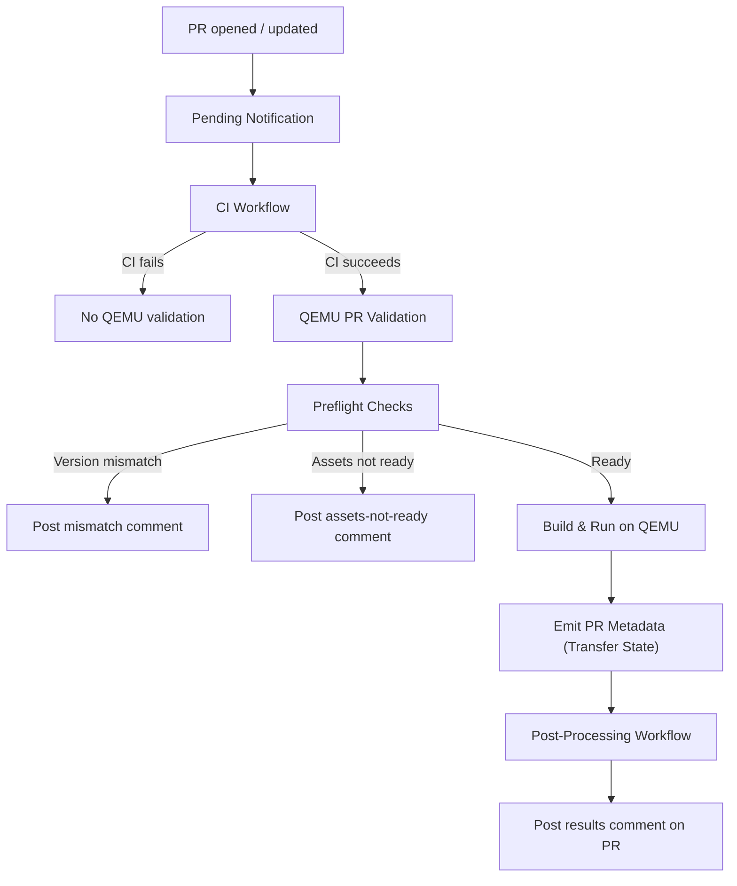
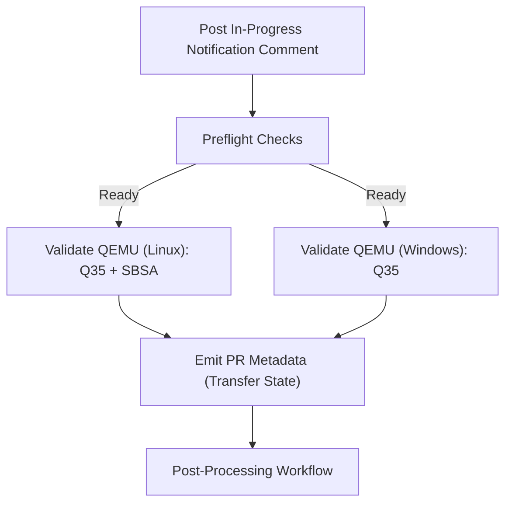
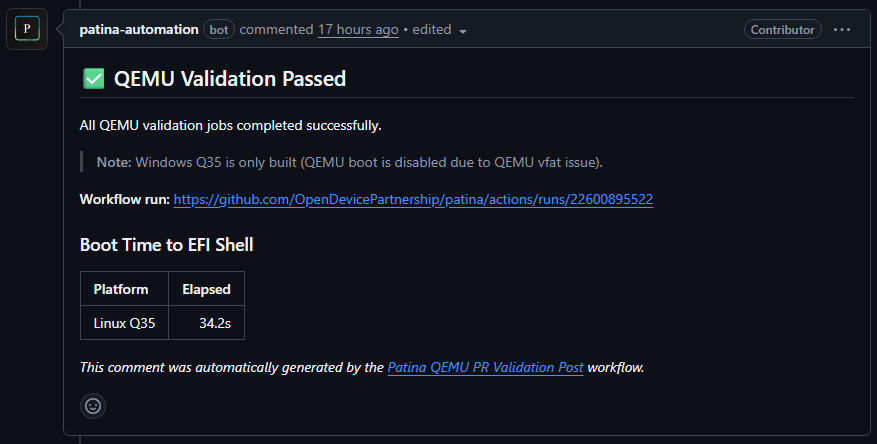
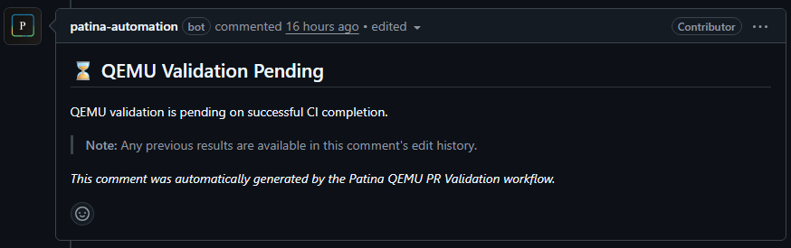
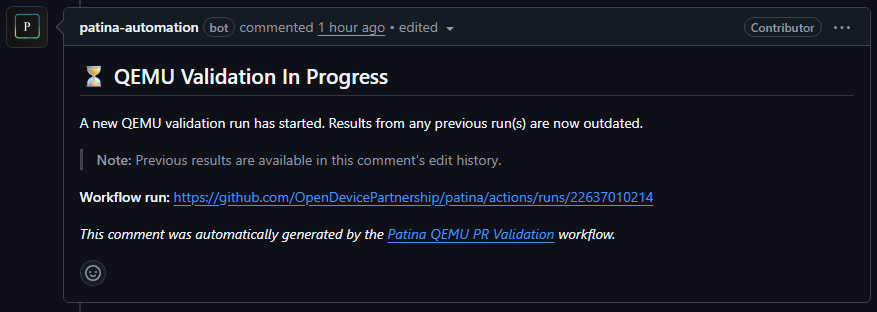
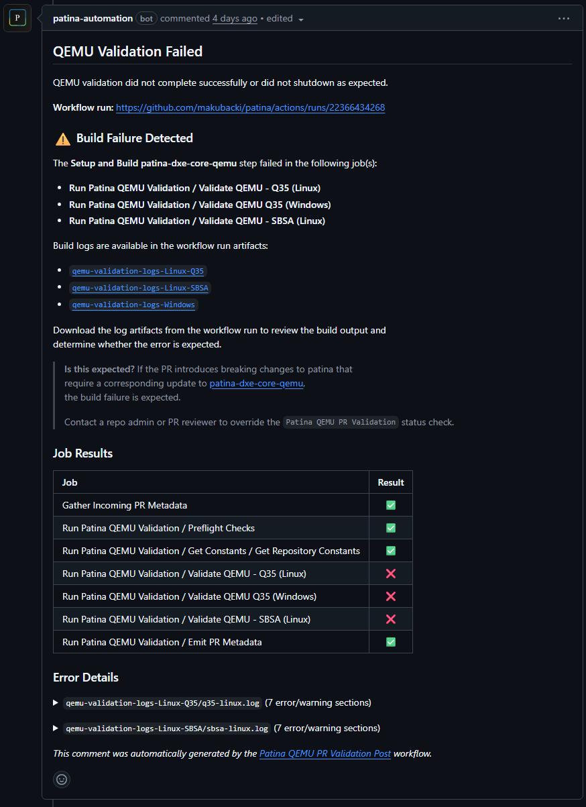
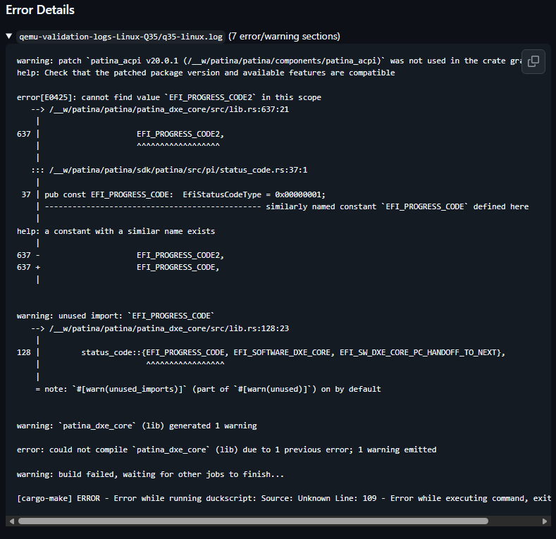
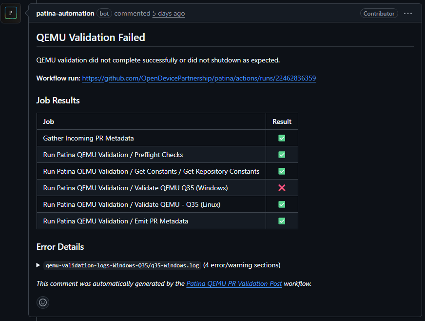
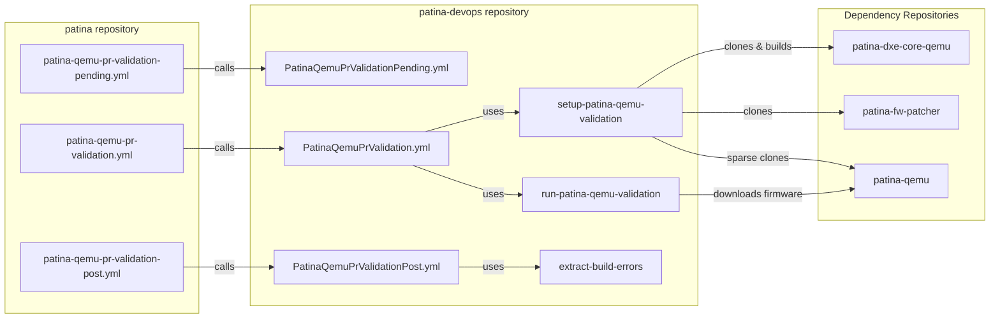

# QEMU PR Validation

Pull requests to the `patina` repository are automatically validated against QEMU-based virtual machine platforms to
ensure that incoming Rust changes compile and boot correctly on supported targets. This workflow runs after CI completes
and posts the results directly to the pull request as a comment.

This documentation is intended for those more interested in the details behind this process. Otherwise, you do not
need to understand the inner workings of the workflow, it simply runs automatically on every PR and provides feedback
in a PR comment.

## Overview

Patina repositories are designed to optimize the developer experience. While the QEMU PR validation workflow directly
supports this goal by providing boot results on every push to a Patina pull request, this capability is enabled by
leveraging the existing developer facilities available across Patina repositories.

### Dependencies

The workflow relies on several repositories and components:

- [patina](https://github.com/OpenDevicePartnership/patina) — The main Patina development repository.
  - Contains the lightweight caller workflow files that trigger QEMU validation on pull requests.
  - Depends on: GitHub workflow files (callers), patina source code, and incoming PR changes
- [patina-devops](https://github.com/OpenDevicePartnership/patina-devops) — Reusable workflows and composite actions
  that implement the overall workflow and validation logic.
  - Depends on: GitHub workflow files (callees) and GitHub actions
- [patina-fw-patcher](https://github.com/OpenDevicePartnership/patina-fw-patcher) — Tools used to patch the Patina DXE
  Core binary into the pre-compiled firmware ROM.
  - Depends on: The Patina patching script ([`patch.py`](https://github.com/OpenDevicePartnership/patina-fw-patcher/blob/main/patch.py))
    - Note: This script can patch a Patina binary into a firmware ROM on physical and virtual platforms to prevent
      rebuilding the rest of the ROM image.
- [patina-dxe-core-qemu](https://github.com/OpenDevicePartnership/patina-dxe-core-qemu) — An integration repository for
  building the Patina DXE Core for QEMU platforms, combining Patina code with platform customizations.
  - Relevant Inputs: Rust library crates (such as the `patina` crate), platform customizations, and build configuration.
  - Relevant Output: Patina DXE Core EFI binaries built for QEMU platforms.
  - Depends on: The `patina-dxe-core-qemu` source code
- [patina-qemu](https://github.com/OpenDevicePartnership/patina-qemu) — Hosts the actual UEFI firmware code that is
  built into a ROM image and run as the firmware on QEMU virtual machines.
  - Relevant Inputs: Patina DXE Core EFI binary and QEMU platform UEFI code.
  - Relevant Output: Firmware ROM binaries built with the Patina DXE Core that can be booted on QEMU.
  - Depends on: The latest ROM image made available as release asset in
    [`patina-qemu` GitHub releases](https://github.com/OpenDevicePartnership/patina-qemu/releases)

### Supported Platforms

| Platform | Host Operating System | Architecture |
|:---------|:----------------------|:-------------|
| Q35      | Linux                 | x86_64       |
| SBSA     | Linux                 | aarch64      |
| Q35      | Windows               | x86_64       |

At any given time, a subset of these platforms may be disabled due to known issues or maintenance work. The PR comment
will indicate which platforms were actually validated on each run.

## Workflow Lifecycle

The QEMU PR validation workflow builds the [patina-dxe-core-qemu](https://github.com/OpenDevicePartnership/patina-dxe-core-qemu)
integration repository with the PR's changes patched in, then boots the resulting firmware on QEMU for each supported
platform and operating system combination. Results are posted back to the PR as a single comment that is updated on
each subsequent push.

The workflow maintains a state machine to track the progress and outcome of each run. Those states are reflected in the
comments posted in the pull request. The main states include:

- **Transient states**:
  - **Pending** — The workflow is waiting for CI to complete. This state is set immediately when a PR is opened or
    updated. If CI fails, the workflow will not leave this state as no further validation will be attempted.
  - **In Progress** — The workflow has started running on the latest commit.

- **Terminal states**:
  - **Preflight results**:
    - **Version Mismatch** — The major version of `patina` in the PR does not match the major version currently used in
      `patina-dxe-core-qemu`. The integration repository must be updated before validation can run. Any patina member
      that sees this state, should update the `patina-dxe-core-qemu` repository to depend on the new major version.
    - **Assets Not Ready** — The latest `patina-qemu` release does not yet have the firmware ROM assets available. This
      can occur immediately after a new `patina-qemu` release is created and assets are still being uploaded.
      Any patina member that sees this state, should verify that the latest `patina-qemu` release is in progress and
      wait for it to complete before rerunning the workflow.
  - **Build and runtime results**:
    - **Success** — The firmware built and booted successfully on all validated platforms.
    - **Build Failure** — The firmware failed to build for at least one platform. The comment includes details about
      which platforms failed and links to the build logs.
      - It is possible that a `patina` PR has changes that will break the `patina-dxe-core-qemu` build. In this case, a
        repository admin or PR reviewer can override the status check to allow the PR to merge. A note in the comment
        posted also provides this guidance. The integration repository should be updated as soon as possible to restore
        validation for future PRs.
    - **Runtime Failure** — The firmware built successfully but failed to boot on at least one platform. The comment
      includes details about which platforms failed and links to the execution logs.

### Phase 1: Pending Notification

When a pull request is opened, synchronized, or reopened, a lightweight workflow immediately posts (or updates) a
comment on the PR indicating that QEMU validation is pending. This prevents stale results from a previous push from
being visible while CI is still running.

### Phase 2: CI Gate

QEMU validation only runs after the CI workflow completes successfully. If CI fails, QEMU validation is skipped
entirely. This avoids wasting compute resources on code that does not pass basic checks.

### Phase 3: QEMU PR Validation

This is the main workflow. It is triggered after CI succeeds for a pull request. Concurrent runs for the same PR branch
are automatically cancelled so only the latest push is validated.

The workflow is organized into the following jobs:

The Linux and Windows jobs run in parallel. Additionally, a matrix is used within the Linux job to further parallelize
validation across the Q35 and SBSA platforms.

While full support is available for building and running on Linux and Windows hosts, there is not a significant
advantage for doing so from a Patina firmware validation perspective. It may be decided to focus on Linux hosts in the
future to reduce maintenance overhead, however, the code for both should always be kept up to date and runnable to
preserve the option for Windows validation in the future if desired.

#### In-Progress Notification

The existing PR comment is updated to indicate that a QEMU validation run has started. It is noted in the comment that
previous results are preserved in the comment's edit history.

#### Preflight Checks

Before building or running anything, the preflight job verifies that the environment is ready:

1. **Version compatibility** — The major version of the `patina` crate in the PR is compared against the major
   version expected by `patina-dxe-core-qemu`. If there is a major version mismatch, validation cannot proceed
   and a comment is posted explaining the situation.

2. **Firmware asset availability** — Pre-compiled firmware binaries are published as release assets in
   [patina-qemu](https://github.com/OpenDevicePartnership/patina-qemu). The preflight job confirms that firmware
   zip files for all platforms exist in the latest release. If they are still being uploaded (e.g., immediately
   after a new release is created), validation is deferred. This is needed because the workflow only patches
   the PR's Patina DXE Core into existing patina-qemu releases, it does not rebuild the rest of the firmware image.

3. **Caching** — The GitHub cache is used to reduce GitHub API callouts across runs. Cache keys are derived from
   release tags and commit hashes so they automatically invalidate when upstream repositories change.

#### Platform Validation

Once preflight checks pass, parallel jobs build and run the firmware on each platform/OS combination.

Each validation job performs the following steps:

1. **Checkout** the `patina` repository at the PR's head commit.
2. **Clone dependencies** — `patina-dxe-core-qemu`, `patina-fw-patcher`, and `patina-qemu` are cloned and set up.
   - Note: `patina-qemu` is sparse cloned to only fetch the firmware assets and build script, skipping the full QEMU
     source code to save time and space.
3. **Build** — `patina-dxe-core-qemu` is built with a
   [crate patch](https://doc.rust-lang.org/cargo/reference/overriding-dependencies.html#the-patch-section) pointing
   to the PR's `patina` source. This replaces the released `patina` crate with the PR's version so the build and
   execution include the proposed changes.
4. **Download firmware** — Pre-compiled firmware ROM files are downloaded from the latest `patina-qemu` release
   (cached when possible).
5. **Run QEMU** — The firmware is booted on QEMU in headless mode. QEMU is configured to shut down after the boot
   completes so the job can verify that the boot succeeded.
   - Currently, only boot to EFI shell is verified in this workflow.
6. **Upload logs** — Build and execution logs are uploaded as workflow artifacts.

The build and run phases are separated so that build failures and runtime failures can be clearly distinguished in
the results.

#### Metadata Emission

After all platform validation jobs complete (regardless of success or failure), a final job collects the outcomes
from each job and writes a metadata JSON artifact. This artifact is consumed by the post-processing workflow. This step
simply exists to transfer data in a clean, auditable way between workflows.

### Phase 4: Post-Processing

The post-processing workflow is triggered after the QEMU PR Validation workflow completes. This workflow downloads the
metadata and log artifacts from the validation run, then posts (or updates) a comment on the PR with the results.

## PR Comment Behavior

All QEMU validation feedback is consolidated into a single comment on the PR. The comment is created on the first
run and updated in place on subsequent pushes. The edit history of the comment preserves results from previous runs.

The comment content varies depending on the outcome:

| Outcome | Comment Content |
| :------- | :-------------- |
| **Pending** | Indicates QEMU validation is waiting for CI to complete. |
| **In Progress** | Indicates a validation run has started. |
| **Success** | Lists all jobs as passed. Includes a boot time summary table. |
| **Build Failure** | Highlights which jobs had build failures. Includes extracted compiler error snippets and links to log artifacts. |
| **Runtime Failure** | Shows a job result table with error details extracted from execution logs. |
| **Version Mismatch** | Explains that `patina-dxe-core-qemu` needs to be updated for the new major version. |
| **Assets Not Ready** | Explains that firmware binaries are not yet available in the latest `patina-qemu` release. |

### Comment Examples

#### Success

#### Pending

#### In Progress

#### Build Failure

##### Build Failure Details

Dropping into the details of a build failure, the comment includes snippets of compiler errors extracted from the logs
to help developers quickly understand the root cause without having to dig through logs. Links to the full logs are also
provided for deeper investigation.

#### Runtime Failure

## Overall Architecture

The following diagram shows the relationship between the repositories and workflows involved in the validation
process.

There are a few reasons why the workflow is separated this way:

1. **Triggers** - The initial workflow files in the `patina` repository are responsible for responding to GitHub events
   (e.g., PR opened, PR updated). These events are only available to workflows that reside in that repo.
2. **Secrets** - The CI workflow runs with a `pull_request` trigger type. This trigger type does not have access to
   secrets for PRs from forks by default. However, the QEMU validation workflow needs access to secrets to make
   authenticated GitHub API calls and write access to post comments. The trigger for these workflows is configured to
   separate responsibilities from the CI workflow and allow secrets in a workflow that is independent of the initial
   PR event trigger.
3. **Dependencies** - Workflows depend on actions. Having workflow logic in `patina-devops` means those actions do not
   have to be duplicated across repositories that might share a workflow/action with other repositories. It also means
   updates to those actions are consolidated in one repo focused on devops and don't thrash the review focus and history
   of other repos.

## Handling Expected Failures

There are cases where a QEMU validation failure is expected:

- **Breaking changes** — If a PR introduces breaking API changes to `patina` that require a corresponding update
  to `patina-dxe-core-qemu`, the build step will fail because the integration repository has not yet been updated.
  In this case, a repository admin or PR reviewer can override the status check.

- **Major version bumps** — If the major version of `patina` in the PR does not match what `patina-dxe-core-qemu`
  expects, the preflight check will fail and report the mismatch. The integration repository must be updated
  before QEMU validation can run.

## Troubleshooting

### Viewing Full Logs

Build and execution logs are uploaded as workflow artifacts on every run. To access them:

1. Navigate to the workflow run linked in the PR comment.
2. Scroll to the **Artifacts** section at the bottom of the run summary.
3. Download the `qemu-validation-logs-*` artifacts for the relevant platform.
